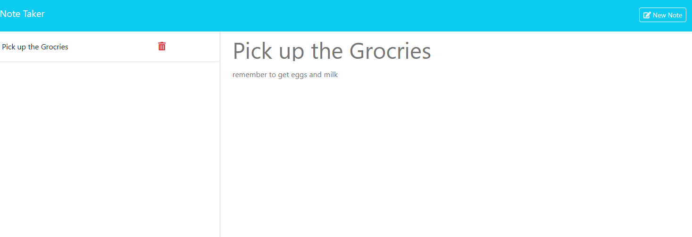

# Note Taker

## Table of Contents
- [Description](#description)
- [Installation](#installation)
- [Usage](#usage)
- [License](#license)
- [Contributing](#contributing)
- [Questions](#questions)

## Description
My app lets you write, save, delete, and access your notes on one website. Once you enter the site, you will be able to write notes and access all saved notes on a sidebar. You get to choose whether to delete them or make a new note.

## Installation
Simply use the commands within the terminal: npm install -> npm start 

## Usage
Write your notes in the empty fields to the right. You can save your notes with the "Save Note" button or clear what you wrote with the "clear form" button. After you have saved a note you can access all saved notes on side bar to the left where you can click on a note to see it or delete it. Once you have created a note you can make a new note with the button "New Note" in the same place as the save note button.

## Questions
For any questions, you can reach me at:
- GitHub: [MIKEYP53](https://github.com/MIKEYP53)
- Email: mprz646@gmail.com
